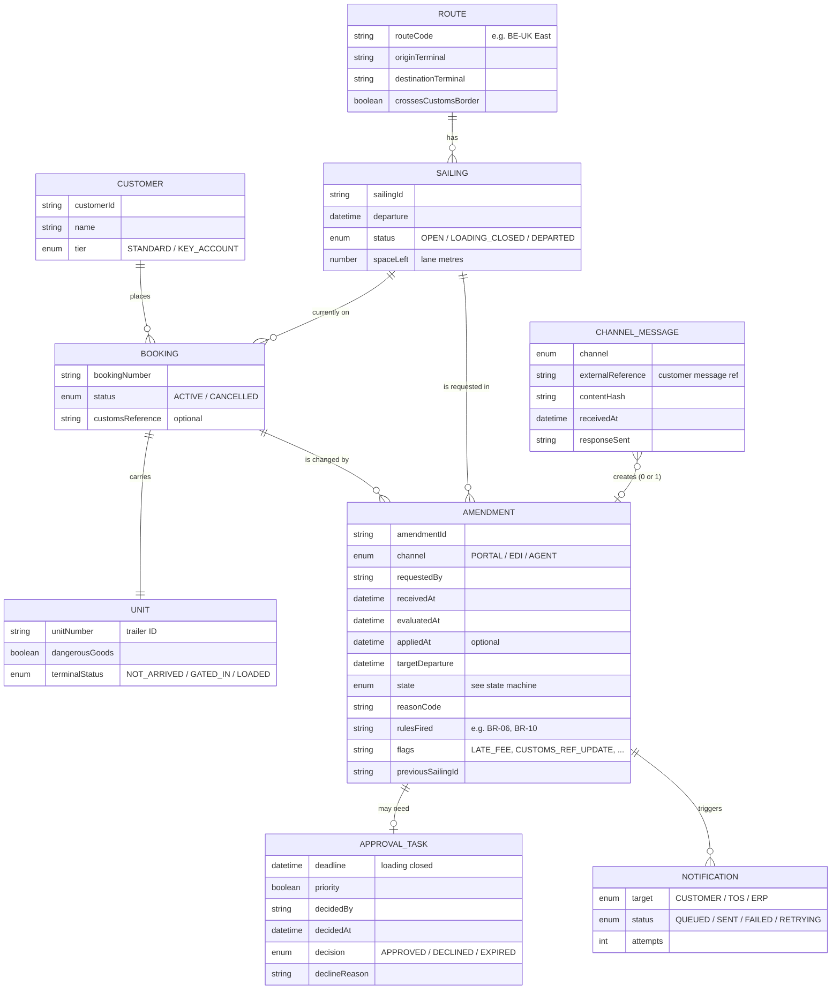

# Logical data model — booking amendments

> **What this is:** the information the feature needs, as entities, attributes and relationships — not tables or columns. The development team decides the physical model. **For:** developers, testers, data and reporting people. **Previous:** [state machine](state-machine.md) · **Next:** [EDI amendment interface](../06-interfaces/edi-amendment.md).

## Modelling decisions

| Decision | Why | Alternative considered |
|---|---|---|
| **Amendment is its own entity**, the booking only points to its current sailing | History (US-10), fees with proof (BR-13), and pending states (BR-10) all need the request to exist next to the booking. Today's model overwrites the booking. | Audit columns on Booking: loses pending and rejected requests |
| **Channel message is separate from amendment** | Duplicates and "no change" (BR-01, BR-02) must be logged without becoming amendments | Flag on Amendment: would create amendments that are not real |
| `previousSailingId` on Amendment | Answers "where did it come from?" without walking the history | Derive from the previous amendment: fragile when the first booking was never amended |
| `rulesFired` stored | Support can answer "why was this rejected?" by rule ID, matching the [KB article](../08-handover/kb-article.md) | Recompute: rules and parameters may have changed since |
| **Notification state is independent** | A committed booking stays Applied while TOS delivery is queued, retrying or failed. Support sees both states. | Roll back on delivery failure: can undo a valid customer change |
| **Receipt and execution times are separate** | Cut-off eligibility uses receivedAt; execution checks use the current time and actual loading status. | Receipt time for everything: can execute after closure |
| Unit terminal status is **read**, not owned | The TOS is the system of record for gate status (A-02) | Copy into booking: goes stale (that is incident N-08) |

## System of record

| Information | System of record | Used here for |
|---|---|---|
| Sailing schedule, space left | Booking system (capacity module) | BR-05, BR-06 |
| Unit terminal status | TOS | BR-04, BR-09, BR-10 |
| Customer tier | CRM / commercial master data | BR-11 |
| Amendment, approval task | Booking system (this feature) | everything |
| Fee amount | ERP | BR-13 (flag only) |

---

Previous: [← State machine](state-machine.md) · Next: [EDI amendment →](../06-interfaces/edi-amendment.md)
