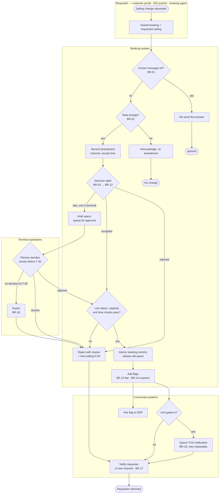

# Process — sailing change (TO-BE)

> **What this is:** the TO-BE flow of a sailing-change request across the requester, the booking system, terminal operations and the connected systems. Modelled with swimlanes in Mermaid so it renders on GitHub and stays diffable; the same flow can be drawn in BPMN in any modelling tool. **Previous:** [user stories](../04-backlog/user-stories.md) · **Next:** [state machine](state-machine.md).

## AS-IS in one line per channel

Portal: allowed until 24 h before departure, then "please call" → Agent: rules from memory and Excel, change typed in → EDI: overwrites the booking without checks → Terminal: hears about it late, or not at all.

## TO-BE

## Notes on the model

| Element | Why it is modelled this way |
|---|---|
| Duplicate and "no change" checks **before** "record amendment" | They are not business decisions. Recording them as amendments would create noise in the history and duplicate fees (D-03). They are kept in the message log instead. |
| One decision node for all channels | BR-17. The lane "Requester" has three actors but one path. |
| Approval returns to "move booking" | An approved request follows exactly the same path as an accepted one: same flags, same notifications. One path means one set of tests. |
| Expiry as its own step | The clock is an actor (found by the tester in the [event storming](../02-event-storming/board.md)). |
| Fee and customs only flagged | Calculation and customs filing are out of scope (release 2, other teams). |

**Owner of the process:** Product Owner Booking & Portal. **Trigger:** a sailing-change request in any channel. **Output:** an amendment with an outcome, and notifications.

---

Previous: [← User stories](../04-backlog/user-stories.md) · Next: [State machine →](state-machine.md)
