# State machine — Amendment

> **What this is:** the states an amendment can be in, and what moves it from one to the next (UML state diagram in Mermaid). Developers use it for the status field and allowed transitions; testers use every arrow as a test case. **Previous:** [process](process-to-be.md) · **Next:** [logical data model](logical-data-model.md).

```mermaid
stateDiagram-v2
  [*] --> Received: request recorded
  Received --> Accepted: on time (BR-07)
  Received --> Rejected: BR-03/04/05/08/09/12
  Received --> PendingApproval: late, unit gated in (BR-10)
  PendingApproval --> Accepted: planner approves before T-30; live checks pass
  PendingApproval --> Rejected: planner declines
  PendingApproval --> Rejected: expired at loading closed (BR-18)
  PendingApproval --> Superseded: newer request on same booking (BR-15)
  Accepted --> Rejected: execution guard fails on retry
  Accepted --> Applied: atomic booking commit; notifications queued
  Applied --> [*]
  Rejected --> [*]
  Superseded --> [*]
```

## States

| State | Meaning | Visible to customer as | Final? |
|---|---|---|---|
| Received | recorded, not yet decided (milliseconds for on-time requests) | — | no |
| PendingApproval | waiting for terminal operations; space held | "The terminal is checking your request (until hh:mm)" | no |
| Accepted | decided yes, booking about to move | — | no |
| Applied | booking committed, flags stored, notifications durably queued | "Your trailer is booked on …" | yes |
| Rejected | decided no; `reason` says why (incl. `APPROVAL_EXPIRED`, `DECLINED_BY_TERMINAL`) | plain-language reason | yes |
| Superseded | replaced by a newer request before a decision | "Replaced by your later request" | yes |

## Rules about transitions

- **No transition out of a final state.** A customer who wants to change an applied amendment makes a new request.
- **Accepted → Applied is not a business decision** but must be atomic for the user: if moving the booking fails, the amendment stays Accepted and is retried; it never shows as Applied with the booking on the old sailing.
- **Duplicates and "no change" never enter this machine** (they are not amendments; see [process](process-to-be.md#notes-on-the-model)).
- **Notification delivery is separate:** QUEUED → SENT, or QUEUED → RETRYING → SENT/FAILED. A failed delivery leaves the amendment Applied. Three failed attempts alert support. Duplicate deliveries are harmless by amendment ID.
- **Current execution guard:** before automatic commit and approval, verify current status/capacity and time strictly before T-30. Expiry wins if approval races the deadline. If commit retries reach T-30, reject with LOADING_CLOSED; no fee or notification is posted. The implementation must atomically guard commit and reservation.
- Only one amendment per booking can be in `PendingApproval` at a time (BR-15).

---

Previous: [← Process](process-to-be.md) · Next: [Logical data model →](logical-data-model.md)
