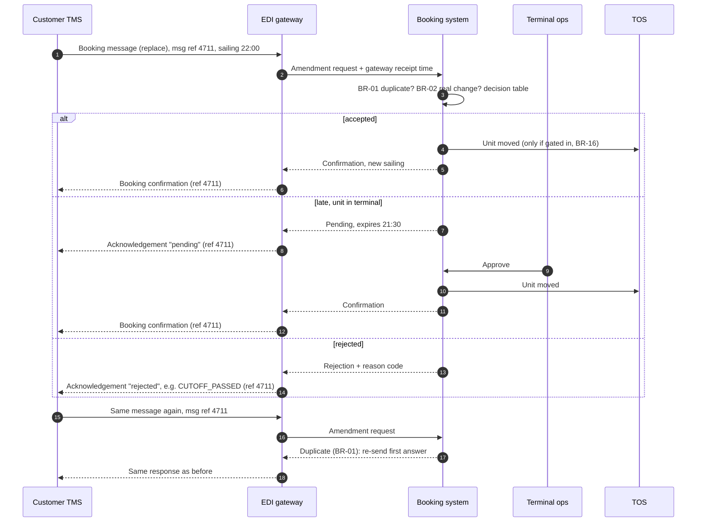

# Interface — EDI amendment (functional description)

> **What this is:** what the EDI amendment interface must do, described functionally: which messages, which fields matter, how duplicates and errors behave, and what goes back. The technical message implementation guide is written by the EDI team from this. **For:** EDI team, developers, testers, pilot customers. **Previous:** [logical data model](../05-models/logical-data-model.md) · **Next:** [portal API and terminal notification](portal-and-terminal.md).

*Message names are simplified and "IFTMIN-like" / "IFTMBC-like" / "APERAK-like". This is not an implementation guide for any real partner.*

## Messages

| Direction | Message | When |
|---|---|---|
| Customer → us | Booking message (IFTMIN-like), function **change** or **replace** | customer wants another sailing |
| Us → customer | Acknowledgement (APERAK-like) | always, within 5 min (NFR-02): received, rejected, or pending |
| Us → customer | Booking confirmation (IFTMBC-like) | amendment applied |

## Sequence

## Fields the decision needs

| Business information | Where it comes from in the message (simplified) | Rule | If missing or wrong |
|---|---|---|---|
| Customer message reference | document number in the message header | BR-01 | reject: syntax error, no amendment |
| Message function (change / replace) | message function code (4 = change, 5 = replace) | BR-02 | treat as replace |
| Booking number | booking reference | — | reject: UNKNOWN_BOOKING |
| Requested sailing | transport details (voyage / departure date-time) | BR-03, BR-05, BR-06 | reject: UNKNOWN_SAILING |
| Route | load and discharge locations | BR-03 | derived from the sailing; mismatch → reject ROUTE_CHANGE |
| Unit | equipment details (trailer ID) | — | must match the booking; a different unit is a unit change → release 2, reject UNIT_CHANGE_NOT_SUPPORTED |
| Dangerous goods | DG segment present | BR-06, BR-08 | DG on booking but not in message → keep DG (never downgrade by omission) |

## "Replace" messages and real changes

The pilot customer (N-06) sends the whole booking for every change. For a **replace**, the system compares the business fields above with the current booking:

| Difference | Result |
|---|---|
| none | NO_CHANGE (BR-02): positive acknowledgement, no amendment, no fee |
| only the sailing | evaluated as a sailing change |
| sailing + other fields | sailing change evaluated; other differences rejected with UNIT_CHANGE_NOT_SUPPORTED in release 1 |
| only non-business fields (free text, contact name) | NO_CHANGE; text stored on the booking |

## Error handling

| Situation | Behaviour |
|---|---|
| Syntax error (gateway cannot parse) | Gateway answers with a syntax report; booking system not involved |
| Booking system unavailable | Gateway queues and retries; receipt time stays the **gateway** time for cut-off eligibility (Q-03). Before committing, recheck current status/capacity and actual loading closure. At T-30 or later reject LOADING_CLOSED, even when received on time. Log both times and alert support on recurrent internal delays |
| Two different messages for the same booking within seconds | Processed in gateway receipt order; the second may supersede a pending first (BR-15) |

## Reason codes sent back

`ROUTE_CHANGE` · `NOT_AMENDABLE` · `LOADING_CLOSED` · `NO_CAPACITY` · `DG_CUTOFF_PASSED` · `CUTOFF_PASSED` · `APPROVAL_EXPIRED` · `DECLINED_BY_TERMINAL` · `UNKNOWN_BOOKING` · `UNKNOWN_SAILING` · `UNIT_CHANGE_NOT_SUPPORTED`

---

Previous: [← Logical data model](../05-models/logical-data-model.md) · Next: [Portal API and terminal notification →](portal-and-terminal.md)
